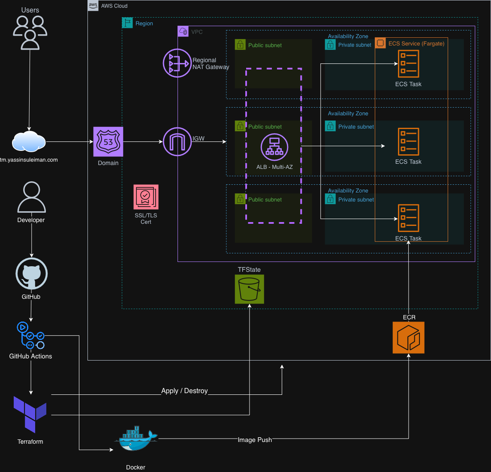
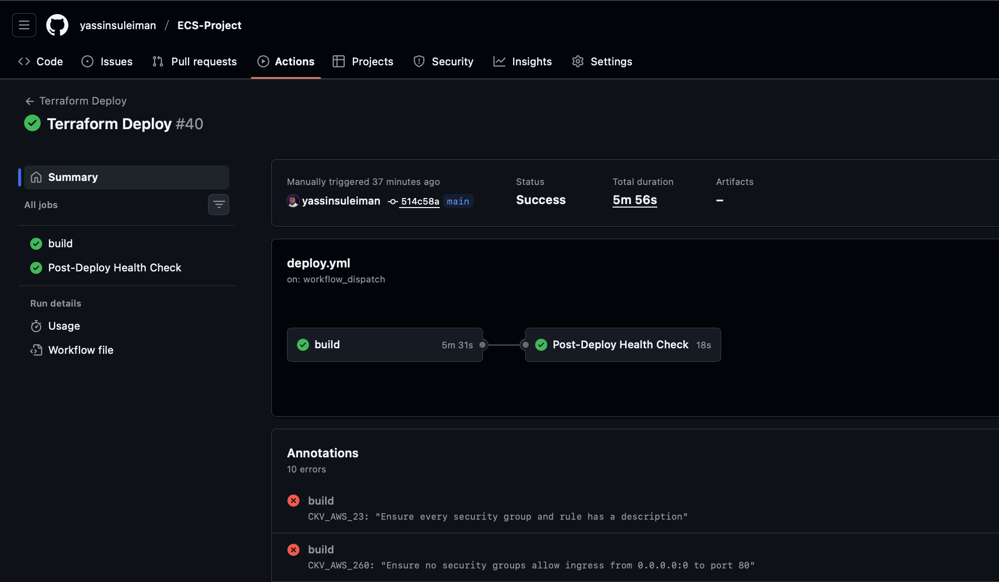

# Gatus ECS Deployment Project
A production-ready infrastructure-as-code project for deploying **[Gatus](https://github.com/TwiN/gatus)** on **AWS ECS (Fargate)** using **Terraform** and **GitHub Actions CI/CD (OIDC)**.

## What This Project Does

This project deploys Gatus as a **production-style, cloud-hosted application** on AWS:

- **Scalable hosting**: Runs on **AWS ECS Fargate** (serverless containers)
- **High availability**: Deployed across **multiple Availability Zones**
- **Secure access**: **HTTPS** via **ACM** + **ALB** with a custom domain (Route 53)
- **Private compute**: Tasks run in **private subnets** (no public IPs)
- **Automated delivery**: GitHub Actions workflows for build → scan → plan → apply
- **Security checks**: Container scanning (**Trivy**) + IaC scanning (**Checkov/TfSec**)

---


## Architecture Diagram



*Architecture diagram showing the complete AWS infrastructure setup for the Gatus application deployment on ECS Fargate.*


## What is Gatus?

**Gatus** is a lightweight uptime monitoring and status dashboard that helps DevOps / platform teams:

- **Monitor services**: Check HTTP/TCP/ICMP endpoints on a schedule
- **Validate health**: Use real health checks (e.g. `/health`) to confirm service availability
- **Visualize status**: Simple UI to see uptime, latency, and incidents at a glance
- **Alerting-ready**: Integrates with common notification channels (depending on config)

Gatus is a great “real-world” demo app because it naturally exercises production concerns like **load balancing, health checks, private networking, TLS, logging, and safe deployments**.

---


## Deployment Status



This repo uses separate GitHub Actions workflows:

- **Build & Push (CI):** Builds the Docker image, runs a **Trivy** vulnerability scan, then pushes to **AWS ECR**.
- **Terraform Deploy (CD):** Runs **Checkov** (IaC scan), then Terraform `fmt/validate/plan/apply`, followed by a `/health` check.
- **Terraform Destroy:** Manual teardown workflow to destroy infrastructure (includes state-lock unlock + retry).

---

## Demo of the Application


*The Gatus web application running in production with HTTPS encryption on the custom domain https://tm.yassinsuleiman.com, deployed on AWS ECS Fargate.*

## Local Setup

Prerequisites: Docker
Run locally:

```bash
cd app

# build
docker build -t gatus:local .

# run
docker run --rm -p 8080:8080 gatus:local

# verify
curl http://localhost:8080/health
```

The Gatus UI will be available at http://localhost:8080.

## Project Structure

```
ECS-Project/
├── .github/
│   └── workflows/
│       ├── build.yml        # Docker build + scan (Trivy) + push to ECR
│       ├── deploy.yml       # Terraform fmt/validate/plan/apply + health check
│       └── destroy.yml      # Manual teardown (terraform destroy)
│
├── app/                     # Gatus app + container build context
│   ├── Dockerfile
│   ├── config.yaml          # Gatus config (checks/alerts)
│   └── ...
│
├── infra/                   # Terraform IaC (modular)
│   ├── main.tf
│   ├── variables.tf
│   ├── outputs.tf
│   ├── terraform.tfvars
│   └── modules/
│       ├── vpc/
│       ├── alb/
│       ├── ecs/
│       ├── ecr/
│       ├── route53/
│       └── acm/
│
├── images/                  # Diagrams + screenshots used in README
│   ├── architecture.png
│   ├── app.png
│   └── ...
│
└── README.md
```


## Security

The infrastructure follows security best practices:

- Terraform state is stored in an encrypted S3 bucket
- State locking is handled via native S3 locking
- ECS tasks run in private subnets
- Security groups use least privilege access
- All traffic is encrypted with HTTPS/TLS
- GitHub Actions uses OIDC authentication instead of long-lived credentials

